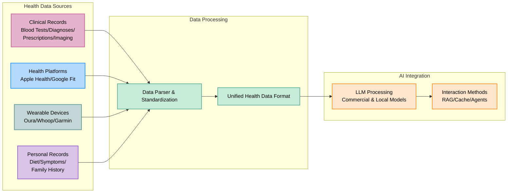

# 🚀 **OpenHealth**

<div align="center">

**AI Health Assistant | Powered by Your Data**

<p align="center">
  
  
  
</p>

</div>

---

<p align="center">
  
</p>

## 🌟 Overview

> OpenHealth helps you **take charge of your health data**. By leveraging AI and your personal health information,
> OpenHealth provides a private assistant that helps you better understand and manage your health. You can run it completely locally for maximum privacy.

## ✨ Project Features

<details open>
<summary><b>Core Features</b></summary>

- 📊 **Centralized Health Data Input:** Easily consolidate all your health data in one place.
- 🛠️ **Smart Parsing:** Automatically parses your health data and generates structured data files.
- 🤝 **Contextual Conversations:** Use the structured data as context for personalized interactions with powerful AI.

</details>

## 📥 Supporting Data Sources & Language Models

<table>
  <tr>
    <th>Data Sources You Can Add</th>
    <th>Supported Language Models</th>
  </tr>
  <tr>
    <td>
      • Blood Test Results<br>
      • Health Checkup Data<br>
      • Personal Physical Information<br>
      • Family History<br>
      • Symptoms
    </td>
    <td>
      • Meta LLaMA<br>
      • Google Gemma<br>
      • DeepSeek-V3<br>
      • and more!
    </td>
  </tr>
</table>

## 🤔 Why We Build OpenHealth

> - 💡 **Your health is your responsibility.**
> - ✅ True health management combines **your data** + **intelligence**, turning insights into actionable plans.
> - 🧠 AI acts as an unbiased tool to guide and support you in managing your long-term health effectively.

## 🗺️ Project Diagram



> **Note:** The data parsing functionality is currently implemented in a separate Python server and is planned to be migrated to TypeScript in the future.

## Getting Started

## ⚙️ How to Run OpenHealth

<details open>
<summary><b>Installation Instructions</b></summary>

1. **Clone the Repository:**
   ```bash
   git clone https://github.com/bisonbet/open-health.git
   cd open-health
   ```

2. **Setup and Run:**

  For a full, self contained application:
   ```bash
   # Copy environment file
   cp .env.example .env

   # Start the application using Docker/Podman Compose with Ollama and Docling with default .env
   docker/podman compose -f docker-compose.yaml --env-file .env --profile ollama,docling up -d

   # Start the application using Docker/Podman Compose with Ollama and Docling with local NVIDIA GPU support with default .env
   docker/podman compose -f docker-compose.yaml -f docker-compose.gpu.yml --env-file .env --profile ollama,docling up -d
   ```

  To use an external docling and/or ollama instance:
   ```bash
   # Copy environment file
   cp .env.example .env

   # Edit environment file - change OLLAMA_URL and/or DOCLING_URL
   nano .env

   # Start the application using Docker/Podman Compose with an external Ollama and Docling
   docker/podman compose -f docker-compose.yaml --env-file .env up -d

   # Start the application using Docker/Podman Compose with a local Ollama and external Docling
   docker/podman compose -f docker-compose.yaml --env-file .env --profile ollama up -d

   # Start the application using Docker/Podman Compose with an external Ollama and local Docling
   docker/podman compose -f docker-compose.yaml --env-file .env --profile docling up -d
   ```

   For making a unique encryption key:
   ```bash
   # Generate ENCRYPTION_KEY for .env file:
   # Run the command below and add the output to ENCRYPTION_KEY in .env
   echo $(head -c 32 /dev/urandom | base64)

   # Rebuild and start the application
   docker/podman compose --env-file .env up -d --build
   ```
   to rebuild the image. Run this also if you make any modifications to the .env file.

3. **Access OpenHealth:**
   Open your browser and navigate to `https://localhost` to begin using OpenHealth.

> **Note:** The system consists of two main components: document parsing and LLM. 
For document parsing, we use docling, an open source project lead by IBM.  You can read more here: 
For LLM chat and vision, we use Ollama and the model(s) of your choice.

> **Note:** On first run, if you are using the local ollama container, it will download two models - gemma3:4b for vision parsing and deepseek-r1:8b for interactive discussion. This will take a bit of time!  You are welcome to use bigger and/or different models limited only by your own hardware specs.

</details>

---

## 🌐 Community and Support

<div align="center">

### 💫 Share Your Story & Get Updated & Give Feedback

</div>

